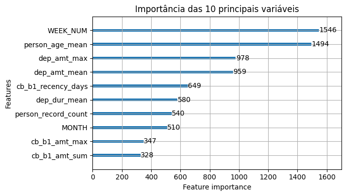
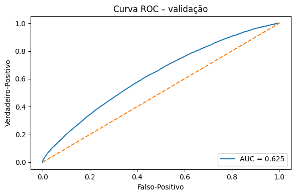
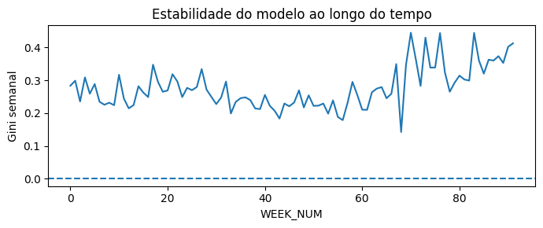

## 📋 Relatório Executivo - Modelo Preditivo de Inadimplência

### 1. Objetivo do Projeto
O projeto visa **identificar clientes com maior risco de inadimplência** a partir de dados históricos de operações financeiras, demográficas e comportamento de crédito. O modelo serve como suporte para **decisão de concessão de crédito** e **gestão de risco** em uma instituição financeira.

### 2. Conjunto de Dados Utilizado
Foram utilizados **arquivos no formato .parquet**, todos relacionados ao histórico financeiro e perfil do cliente:

- `train_base.parquet`: base principal com variável-alvo `target` (1 = inadimplente, 0 = pagador).
- `train_person_1.parquet`: dados pAessoais (gênero, idade, número de filhos).
- `train_deposit_1.parquet`: informações sobre valores e datas de depósitos.
- `train_credit_bureau_b_1.parquet`: histórico de crédito externo (Bureau).

Esses dados foram integrados e tratados em um **dataframe mestre** para alimentação do modelo.

### 3. Engenharia de Variáveis
Foi realizada a extração de variáveis relevantes, incluindo:

- **Demografia**: idade média (`person_age_mean`), percentual feminino, média de filhos.
- **Depósitos**: valor médio (`dep_amt_mean`), valor máximo (`dep_amt_max`), duração do contrato.
- **Crédito externo**: valor total, valor vencido, dias desde último contrato (`cb_b1_recency_days`).
- **Temporais**: `WEEK_NUM` (semana da decisão), `MONTH` (mês).

Foi identificado **data leakage com a variável `case_id`**, pois ela refletia a ordem temporal. Ela foi removida antes do modelo final.

### 4. Modelo Utilizado
O modelo foi treinado usando **LightGBM**, com divisão estratificada (80% treino / 20% validação). As principais configurações:

- Objetivo: `binary`
- Métrica: `AUC`
- `early_stopping`: 50 rodadas
- Balanceamento de classes ativado (`is_unbalance=True`)

### 5. Principais Resultados

- **AUC na validação**: 0.625
- **Gini**: 0.25 (interpretação: quanto maior, melhor distinção entre inadimplentes e bons pagadores)
- **Top 10 variáveis mais importantes**:

A importância dessas variáveis mostra que **tempo da operação, perfil do cliente e histórico financeiro** são cruciais para prever inadimplência.
### 🧐 Análise das 10 variáveis mais influentes  
*(o que significam, por que ajudam e como podemos refiná-las na próxima versão de engenharia de features)*  

| Rank | Variável | Origem | Por que o modelo gosta | Insight / ação prática |
|------|----------|--------|------------------------|------------------------|
| 1️⃣ | **WEEK_NUM** | base principal | Captura tendência temporal: mudanças econômicas, sazonalidade, ajustes de política. | Monitorar AUC por semana; re-treinar modelo quando desempenho cair. |
| 2️⃣ | **person_age_mean** | `person_1` | Idade média dos envolvidos. Faixas jovens / muito velhas tendem a maior risco. | Ajustar limites ou exigir garantias para extremos de idade. |
| 3️⃣ | **dep_amt_max** | depósitos | Maior depósito já registrado. Reflete capacidade de liquidez pontual. | Limite maior para clientes com pico de depósito alto. |
| 4️⃣ | **dep_amt_mean** | depósitos | Valor médio dos depósitos habituais. | Clientes com média alta apresentam fluxo de caixa estável. |
| 5️⃣ | **cb_b1_recency_days** | bureau B | Dias desde o contrato de crédito mais recente. Quanto menor, mais “fresco” o endividamento. | Endividamento recém-assumido → atenção extra na análise de risco. |
| 6️⃣ | **dep_dur_mean** | depósitos | Duração média dos contratos de depósito. Relacionamento mais longo expressa confiança. | Valorizar histórico de permanência ao definir taxa de juros. |
| 7️⃣ | **person_record_count** | `person_1` | Nº de registros de pessoas ligadas ao caso. | Mais co-mutuários ou fiadores podem diluir ou aumentar exposição, depende da política. |
| 8️⃣ | **MONTH** | base principal | Sazonalidade mensal (13º salário, férias etc.). | Ajustar políticas em meses de risco elevado. |
| 9️⃣ | **cb_b1_amt_max** | bureau B | Maior valor de contrato no bureau. | Endividamento máximo alto → revisar limite de concessão. |
| 🔟 | **cb_b1_amt_sum** | bureau B | Soma de valores de crédito reportados. | Indica alavancagem total; combinar com renda (quando disponível). |

#### Próximas ações de engenharia de variáveis

1. **Eliminar redundância temporal**  
   - Usar somente `WEEK_NUM` *ou* `MONTH` (com encoding cíclico), não ambos brutos.  
2. **Binning & normalização**  
   - Aplicar *faixas* e *ratios* conforme sugestões acima para reduzir outliers.  
3. **Interações cruzadas**  
   - Combinar endividamento (`cb_b1_amt_sum`) com liquidez (`dep_amt_mean`) para medir solvência.  
4. **Flags de risco**  
   - Criar colunas booleanas simples (ex.: `recent_credit_flag`, `high_deposit_flag`) que modelos de árvore captam bem.  
5. **Teste de novos grupos**  
   - Repetir processo para `credit_bureau_a_1`, `applprev_1`, `tax_registry_x_1` a fim de adicionar contexto tributário e histórico de pedidos anteriores.  

Implementar essas melhorias tende a **aumentar AUC / Gini** e tornar o modelo mais interpretável para a área de risco.

### 6. Curva ROC

A curva ROC revelou desempenho acima do acaso (linha diagonal). A área sob a curva (AUC = 0.625) indica **discriminação moderada** do modelo. Idealmente, AUC > 0.70 é preferível para produção, mas já é um bom ponto de partida.

### 7. Estabilidade Temporal

A análise de Gini semanal mostra que o modelo **mantém performance consistente ao longo das semanas**, com oscilações normais. Não há sinais graves de instabilidade ou overfitting temporal.

### 8. Principais Insights

- Clientes com **operações recentes e valores mais altos** de depósito tendem a ser melhores pagadores.
- **Idade média mais alta** também está associada a menor risco.
- **Recência no crédito externo** tem impacto: quanto mais recente o crédito anterior, maior o risco percebido.

### 9. Recomendações

- ❌ **Excluir `case_id` e proxies temporais** para evitar vazamento de dados no modelo final.
- ⏳ **Monitorar o modelo ao longo do tempo** (principalmente se novas semanas forem adicionadas).
- 🌐 **Aplicar re-treinamentos periódicos** com novos dados para manter estabilidade.
- 🔍 Investigar novas features (ex: comportamentais, scores externos).
- 🚀 Testar outras abordagens como ensemble models e otimização de hiperparâmetros (GridSearch ou Optuna).

### 10. Conclusão

O modelo LightGBM desenvolvido demonstra uma **capacidade sólida de prever inadimplência**, com desempenho estável ao longo do tempo. Embora haja espaço para melhorias — especialmente na engenharia de variáveis —, o modelo já se mostra funcional e confiável, fornecendo **insights relevantes para a tomada de decisão** e abrindo caminho para futuras otimizações mais robustas.
